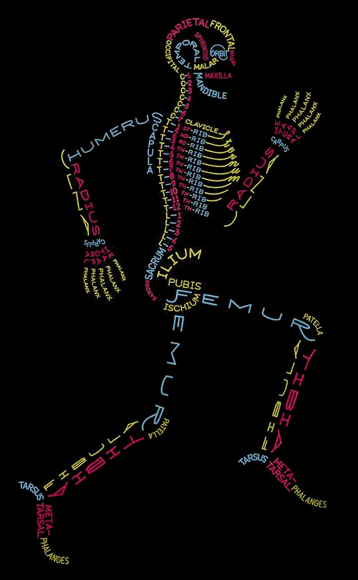
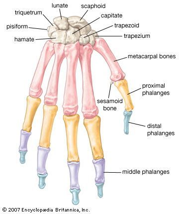
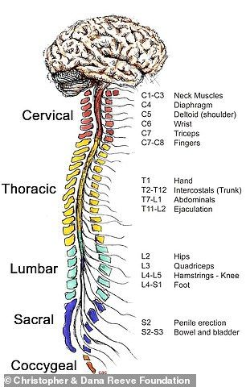
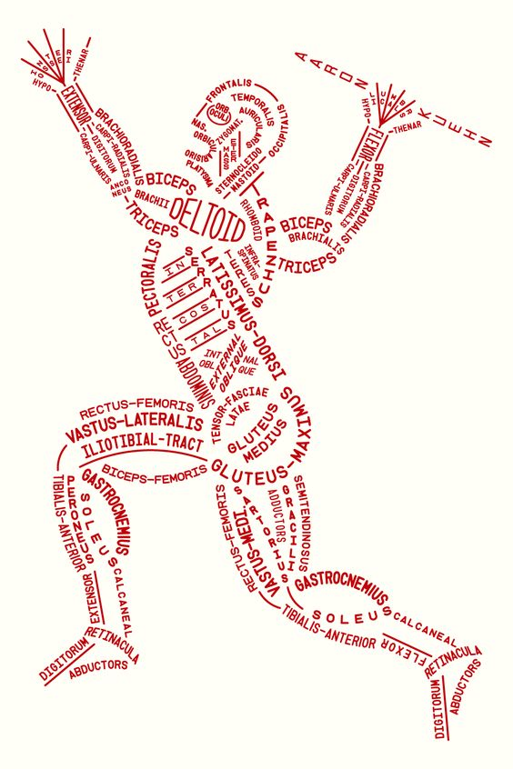
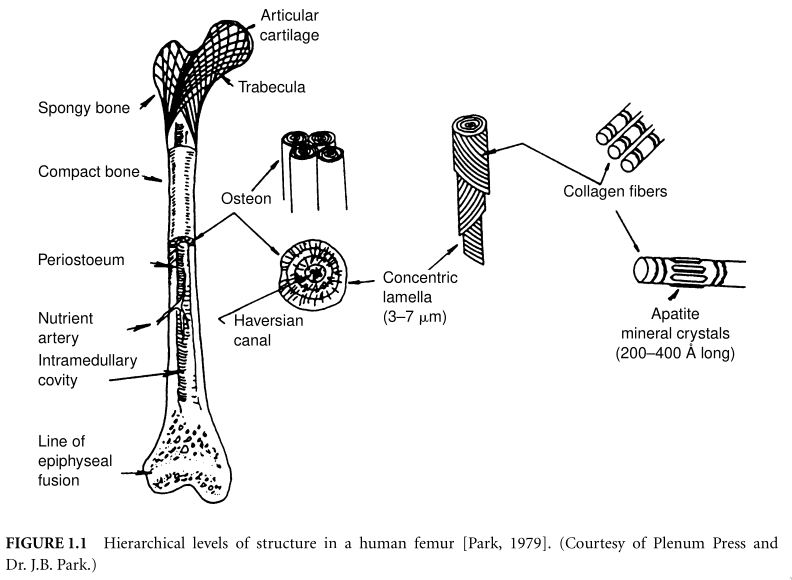
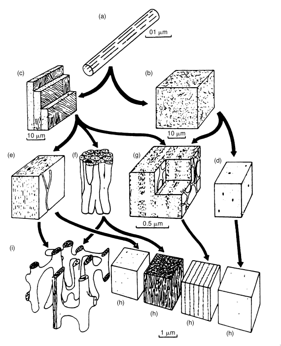
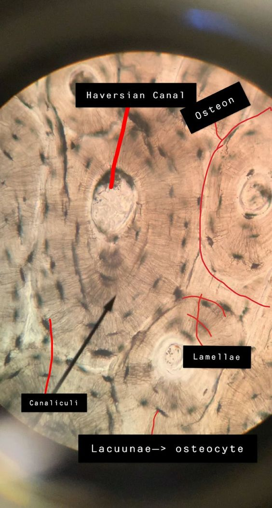

# Human Biology

## Introduction to human body

### Cells 

* Types of Living Cells

1. Prokaryotes
    - Single-celled organisms that lack a nucleus and other membrane bound
      organelles. They have a single chromosome that is not enclosed in a
      membrane

1. Eukaryotes 
   1. Cell membrane/Plasma membrane
        - Semi-permeable through channels 
        - Gates (Na/K gates)
        - Active or passive transport
   1. Cytoplasm/Plasma
   1. Rough Endoplasmic recticulum
       - Main assembly line of the cell
       - Contains ribosomes
       - It is in the ribosomes where the amino acids are assembled into
         proteins. 
   1. Smooth Endoplasmic recticulum
       - No ribosomes
       - Ships the products of the reactions that occur within the cell, to
         Golgi apparatus
   1. Lysosomes
       - Sweepers of the cell
       - Contain digestive enzymes that break down the substances that may harm
         the cell
       - Also digest dead organelles
   1. Nucleus and nucleolus
       - Each cell has a nucleus and, inside it, a nucleolus. These serves as
         the control center of the cell and are the root from which all future
         generations originate. A double layer known as the nuclear membrane
         surrounds the nucleus. Usually the nucleus contains a mass called
         chromatin. If the cell enters a stage leading to reproducing itself
         through cell division, the chromatin separates into chromosomes.
       - Conveys genetic information to future generations, plus produces two
         important molecules, messengerRNA and transferRNA, for the
         interpretations of this information.
   1. Centrioles
       - Centrioles behave as the "bus conductors" of the cell. They organize
         microtubules, which help move the parts of the cell during cell
         division.
   1. Golgi apparatus
       - Like logistics. 
       - Receives products from smooth ER and packs them inside vesicles, viz.
         small membrane-enclosed sacs. The vesicles are then mailed to other
         organelles or the cell membrane for export.
   1. Mitochondria
       - Power plant
       - Utilizes carbohydrate glucose to produce energy i.e. ATP (Adenosine
         Triphosphate)
   1. Small vacuoles
       - Storage 

* Classification into two major types:

    1. Stem cells, 

        - Stem cells are undifferentiated and unspecialised cells that have the
          ability to divide and differentiate into specialized cells, such as
          muscle cells, nerve cells, and blood cells.

        - Stem cell differentiation if controlled by complex genetic and
          environmental factors that determine the type of cell a stem cell will
          become. Stem cell differentiation is critical for the development of
          tissues and organs, as well as for the repair and regeneration of damaged
          tissues.

    1. Germ cells,
        
        - Germs cells are reproductive cells (eggs or sperm) that carry genetic
          information and form the next generation.
          
### Cell Growth and Division

* Points to remember:

1. Proteins called hormones help regulate cell growth.

### Tissue (Animal Tissue)

- Classification into four basic types plus sub classifications: 

1. Epithelium 

    1. Simple epithelial Tissue
        1. Simple squamous epithelial tissue
        1. Simple cuboidal epithelial tissue
        1. Simple columnar epithelial tissue 
        1. Pseudo-stratified columnar tissue: 

    1. Stratified epithelial tissue 
        1. Stratified squamous epithelial tissue
        1. Stratified cuboidal epithelial tissue
        1. Stratified columnar epithelial tissue
        1. Transitional epithelium

1. Connective Tissue/Fibrous Tissue

    1. Soft connective tissue, examples include fat, adipose tissue, loose
       connective tissue, areolar tissue, gelatinous tissue
    1. Hard connective tissue, bone, hyaline cartilage, fibrocartilage, elastic
       cartilage, dense connective tissue such as tendons, ligaments, fasica,
       aponeuroses and periosteum.

1. Muscle Tissue/Muscular Tissue

    1. Cardiac muscle tissue
    1. Skeletal muscle tissue
    1. Smooth muscle tissue

1. Nervous Tissue
    1. Neurons

#### Epithelium

- Development

  Epithelial tissues are derived from three embryological germ layers: (i)
  ectoderm, (ii) endoderm and (iii) mesoderm[^3] 

[^3]: It is important to note that pathologists do not consider endothelium and
  mesothelium (both derived from mesoderm) to be true epithelium. This is
  because such tissues present very different pathology. For that reason,
  pathologists label cancers in endothelium and mesothelium sarcomas, whereas
  true epithelial cancers are called carcinomas. 

- Classification into (i) simple and (ii) stratified plus further
  differentiation based on the type of epithelial cells (squamous, columnar and
  cuboidal) that lay on top of the basement membrane.

- The basement membrane acts as a scaffold on which the epithelium can grow and
  regenerate after injuries. The epithelium is composed of tightly packed cells
  with little or no extracellular space. This arrangement allows the epithelium
  to from a barrier between tissues and the external environment, but it
  renders the epithelium avascular, because the cellular arrangement of the
  epithelial cells makes it difficult for blood vessels to penetrate and supply
  the tissue. So the epithelium must be nourished by substances diffusing from
  the blood vessels in the underlying basement membrane. The basement membrane
  acts as a selectively permeable membrane that determines which substances
  will be able to enter the epithelium.

- 

- With simple epithelium, there is only one layer hence every cell is in direct
  contact with the basement membrane. Stratified (or compound) epithelium
  differs from simple epithelium in that it the epithelial cells are arranged
  in strata.

- Given thinness of the epithelial barrier in simple epithelium, it is found in
  areas where absorption and filtration occur; while stratified epithelium is
  found where body linings have to withstand mechanical or chemical pressure
  such that layers can be abraded or lost without exposing the sub-epithelial
  layers.

More on epithelial cells:

1. Squamous
    - Thin and flat, appear polygonal in a cross-section
    - Mainly Diffusive function
    - Provides a smooth and low-friction surface over which fluids move easily
    - Alveoli in the lung and lining of blood vessels

2. Cuboidal
    - Cube-like shape and appear square in a cross-section
    - Large and spherical nucleus in the center of the cell
    - Mainly secretive function + Absorptive function
    - Commonly found in the linings of the exocrine glands, or in absorptive
      tissue such as the pancreas.
    - Germinal epithelium that covers the female ovary and the germinal
      epithelium that lines the wall of seminferous tubules in the testes.
    - Provides active protection in pumping material in or out of the lumen
    - Simple cuboidal commonly differentiates to form the secretory and duct
      portions of glands and stratified cuboidal protects areas such as the
      ducts of sweat glands, mammary glands and salivary glands.

3. Columnar
    - Elongated and column-shaped; height at least x4 their width
    - Nucleus located near the base of the cell
    - Mainly absorptive function + secretive function
    - Posses mircovilli that forms a brush border which increases the surface
      area to facilitate maximum absorption
    - Found in lining of stomach and intestines
    - Cells can also poses cilia which helps to move mucus in the function of
      mucociliary clearance[^2]
    - Ciliated cells are found in fallopian tubes and uterus and the central
      canal of the spinal cord.
    - Some columnar cells are specialized for sensory reception such as in the
      nose (olfactory epithelium), ears and taste buds. Hair cells in the inner
      ears have stereocilia which are similar to microvilli. 
    - Goblet cells are modified columnar cells and are found in the upper
      respiratory tract (respiratory epithelium) and between the columnar
      epithelial cells of the duodenum[^1]. Goblet cells secrete mucus, which
      acts as a lubricant.
    - Stratified columnar epithelium is rare but found in lobar ducts in the
      salivary glands, the eye, the pharync and sex organs. 

[^1]: First part of the small intenstine, which receives partially digested
food from the stomach and begins the absorption of nutrients.
[^2]: Mucociliary clearnce is a defense mechanism is the respiratory system
  that helps to remove foreign particles and mucus from the airways.

4. Pseudostartified 
    - Simple columnar epithelial tissue whose nuclei appear at different
      heights, giving the pseudo impression that they are stratified.
    - Ciliated
    - Found in the airways of the respiratory tract (nose, and bronchi), cilia
      causes mucus secreted locally by the goblet cells to lubricate and trap
      pathogens and particles.
    - Also found in the uterus and fallopian tubes, where the cilia propels the
      ovum to the uterus

5. Transitional
    - Found in tissues that stretch, and it can appear to be stratified
      cuboidal when the tissues are relaxed, or stratified squamous when the
      tissues stretch.
    - Sometimes termed as "urothelium", exclusively found in the bladder,
      ureters and urethra.

6. Keratinized
    - The most apical layers of cells of stratified epithelium lose their
      nucleus and cytoplasm
    - instead these contain a tough, resistant protein called keratin which
      makes them somewhat water-resistant
    - Found in the mammalian skin

7. Parakeratinized
    - The most apical layers of cells that still retain their nuclei are filled
      with keratin
    - Found in the oral mucosa and in the upper regions of oesophagus; the
      lining of the oesophagus mostly contain non-keratinized stratified
      epithelium
### Organization of the Body

1. Macroscopic
    1. Skeletal organization
    1. Muscular organization
1. Microscopic 
    1. Histology: Cells & Tissues

#### Skeletal Organization

#### Muscular Organization

> More on organization of body in subsequent sections (specific to individual
> systems).

### Biomolecules

#### Proteins

The sequential order, number and the chemical identity of the amino acids in
the protein determine the structure of the proteins as well as its functions.

- Amino acids -> an amine group + an acid group attached to the same C atom.
- Amino acids are the ingredients used in the recipe in making a protein
- 100+ known natural amino acids, only the magic 20 used in protein synthesis
- Common properties of amino acids:
    - undergoes (i) hydrophobic reactions, or (ii) hydrophilic reactions or
      (iii) ionic reactions to combine and form proteins
    - have both an acid and a base
    - all, except glycine, have a chiral (asymmetric) nature (four different
      groups are attached to the alpha-carbon -COOH, -NH$_2$, -R and -H).
    - have variations in what part of the structure is protonated depending on
      the pH of the solution and the structure of the rest of the molecule
      (because of their acid-base nature). Under most physiological conditions,
      isolated amino acids exist in there zwitterion form
- The Magic 20 Amino acids are subdivided into four subgroups based on nature
  of the side chain and the general behavior of the amino acid
    1. 8 Nonpolar and uncharged (hydrophobic)
    1. 7 Polar and uncharged (hydrophilic)
    1. 2 Acidic (polar and charged)
    1. 3 Basic (polar and charged)

> LDF (London Dispersion Force) is an example of hydrophobic reaction

## Blood, Molecular Biology & Genetics

### Composition of Blood 

- pH of blood is 7.4
- Erythrocytes outnumber Leukocytes by about 500 to 1.

1. Plasma 
     - Clear, yellowish fluid that makes up about 55% of blood volume 
     - Plasma contains water, electrolytes, proteins, hormones and waste
       products
1. Erythrocytes
    - Disc-shaped cells that carry oxygen from the lungs to the rest of the
      body
    - approx. 4.5 to 5.5 million RBCs per micro liter of blood in adults
    - RBCs have substances such as antigens on their surfaces
1. Leukocytes
    - Cells involved in body's immune response
    - 4500 and 11000 WBCs per micro liter of blood in adults
    - Neutrophils, Basophil, Lymphocytes, Monocytes, Eosinophils
1. Thrombocytes
    - Small, irregularly-shaped cells that play a crucial role in clotting
1. Other Components include small amounts of gases such as oxygen and carbon
   dioxide

> Blood serum is what remains after blood clots and the clotting factors (such
> as fibrin) have been removed from plasma. Blood serum contains a variety of
> substances such as hormones, electrolytes, antibodies, enzymes, and metabolic
> waste products. It can provide important information about a person's health,
> including their liver and renal function, glucose levels, and the presence of
> certain infectious diseases or conditions.
- Types of blood cells and their function
- Clotting factors: Hematopoiesis, Hematopoietic stem cell, Hemostasis
- Coagulation cascades: Extrinsic, intrinsic and common pathway
- DNA, RNA and Protein synthesis
- Techniques of genetic engineering

## Nervous system & Sensory Organs

- Microanatomy and arrangement of neurons
- Types of neurons and their connections
- Functions of neurons
- Impulse generation and basics of neuromusuclar transmission
- Structure of CNS
- Structural details and physiology of human (eye + ear)

## Cardiovascular System & Respiratory System

- Cardiovascular system =  heart and blood vessels
- (i) Pulmonary circulation and (ii) Systemic circulation
- Pulmonary circulation = Pulmonary artery takes deoxygenated blood from right
  heart and pulmonary veins carries oxygenated blood to the left heart.
- Systemic circulation = Loop that carries oxygenated blood from left heart to
  the rest of the body (via. aorta), and deoxygenated blood from rest of the
  body to the right heart (through big veins).
- Respiratory system works in conjunction with the CV system, ensuring that the
  blood continuously gets oxygenated through partial diffusion of gases.

- Coronary circulation 
- Functions of heart
- Cardiac cycle, cardiac output and blood pressure
- Conduction system of heart

- Anatomical and physiological relationship of upper respiratory tract
- Lungs and its topography
- Pleura and pleural cavity
- Lung functions
- Mechanism of breathing
- Types of breathing & Control of respiration
- Understanding of ventilation and long volumes
- Gas transfer & diffusion

## Urinary System

- Metabolic functions of urinary system
- Topography of kidneys
- Microanatomy of kidney
- Structure and functions of ureter, bladder & urethra
- Control of bladder functions

## Biomechanics

### Human joints

> Synarthrosis means immovable, amphiarthrosis mean slightly movable and
> diarthrosis means freely movable.

1. Fibrous joints 
1. Cartilaginous joints
1. Synovial joints

* Fibrous joints
    1. Sutures
        - Sutures in the skull
        - Limited movement until 20 years of age, then they become synarthrosis
        - Most important during birth, deformation of the skull may occur is it
          passes through the birth canal
    1. Gomphoses
        - (_Singular. Gomphosis_)
        - Found where the teeth articulate into their sockets 
        - Synarthrosis
        - Strong periodontal ligament
    1. Syndesmoses
        - (_Singular. Syndesmosis_)
        - Bones are held together by an interosseous membrane
        - Amphiarthrosis
        - Mid radioulnar joint and mid tibiofibular joints are examples 

* Cartilaginous joints
    1. Synchondroses 
        - Bound by hyaline cartilage
        - Synarthrosis
        - Diaphysis and epiphysis of a growing long bone
    1. Symphyses
        - United by a layer of fibrocartilage
        - Amphiarthrosis
        - Pubic symphysis and intervertebral joints

* Synovial joints 
    1. Pivot joint
        - Rotation only
        - formed by a central bony pivot which is surrounded by ligaments
        - between C1 and C2 vertebrae, proximal and distal radioulnar joint,
          atlantoaxial joint
    1. Hinge joint
        - Movement in only one plane i.e. flexion and extension
        - Elbow joint, ankle joint, knee joint
    1. Saddle joint
        - Opposing articular surfaces with a reciprocal concave-convex shape
        - carpometacarpal joints such as the one between trapezium and 1st
          metacarpal bones in the wrist
    1. Plane joint (tarsal bones in the ankle)
        - Gliding movement
        - Articulating surfaces are relatively flat
        - Acromicoclavicular joint, subtalar joint
    1. Condyloid (or Ellipsoid) joint 
        - between radius and carpal bones of the wrist joint, metacarpophalangeal
          joint, metatarsophalengeal joint
    1. Ball and socket joint
        - Free movement in multiple axes
        - ball shaped surface of one rounded bone fits into cup like depression of
          another bone
        - hip and shoulder joint

### Forces in joints (Joint Kinematics)

Various forces act on the joints to (i) maintain stability, (ii) allow movement
(iii) absorb shock. These forces include:

1. Gravity
1. Muscle forces
1. Ligament forces
1. Tendon forces
1. Frictional forces
1. Impact forces

These forces can be compression, tension, torsion or shear depending on the
position and the movement of the joint, as well as the weight and activity
level of the individual.

1. Compression: This occurs when the weight of the body or external forces
   is applied to the joint, causing the bones to compress together.
1. Tension: This occurs when the muscles surrounding the joint generate
   force to move the bones.
1. Shear: This occurs when the forces applied to the joint are not aligned
   with the joint's axis of rotation, causing the bones to move relative to
   each other in a sliding motion
1. Torsion: This occurs when the bones of of the joint rotate relative to each
   other, causing twisting forces within the joint.

Understanding the forces action on a joint is important for proper joint
function, injury prevention and effective rehabilitation.

> #### Things worth noting:
>     
> - The musculoskeletal system can be thought of as a set of connected links,
>   with the bones acting as beams and the joints as the links between them.
> - With this analogy, the movement around the joints can be analyzed much like
>   any other mechanical system. **With static analysis, the forces and moments
>   acting around a joint are balanced** i.e. they are in both rotational and
>   translational equilibrium, and there is assumed to be no acceleration
>   component to the forces.
> - Kinematic analysis of joint mobility can be arranged into two separate
>   categories:
>     1. Gross movement of the limb segments interconnected by joints (Gait
>        Analysis)
>     1. Detailed analysis of three joint articulating surface motion :
>         1. Sliding/Gliding
>             - Pure translation of the moving segment against the surface of a
>               fixed segment. The contact point of the moving segment does not
>               change while the contact point of the fixed segment changes
>               constantly.
>         1. Spinning/Rotation
>             - In this case, the moving segment rotates and so does its
>               contact point, while the contact points on the fixed surface
>               does not change. This is the exact opposite of sliding (or
>               gliding) motion
>         1. Rolling
>             - Rolling motion occurs between moving and fixed segments where
>               the contact points in each surface are constantly changing.

#### Jargon (for Joint Analysis) Simplified 

1. Moment - A moment is when a force creates a rotating or pivoting action, and
   is defined as the product of a force and the moment arm, i.e. the
   perpendicular distance of the line of action of the force from the pivot
   point. 
   A moment balance is the sum of all the moments acting about a point; for
   equilibrium, all clockwise and anti-clockwise moments must be equal and
   opposite.

2. Joint and Moment Arms - The geometric structure of the bones that surround
   and make up a joint provide an increased distance between the point where
   the muscle force acts and the joint's point of rotation.
   The creates a mechanical advantage that it reduces the amount of muscle
   force required for movement.

#### Knee

* Type of joint: Hinge of synovial, amphiarthrosis (movement in only one axis,
  flexion and extension)
* Articulating Surfaces: 
    1. Tibiofemoral articulation -  between distal femur and proximal tibia
    1. Patellofemoral articulation - between distal femur and patella
* Largest and the most complex joint in the body.

#### Ankle

* Type of joint: Hinge of synovial, amphiarthrosis (movement in only one axis,
  plantarflexion and dorsiflexion)
* Articulating Surfaces:  
    1. Talocrural (Ankle) joint - articulation of distal tibia and fibula with
       the trochlea of the talus
    1. Talocalcaneal (Subtalar) joint - articulation of talus with the
       calcaneus

* Geometry of the articulating surfaces
    1. Upper articular surface of the talus is wedge-shaped, it width
       diminishing from front to back. The talus can be represented as a cone.
       The wedge shape of the talus is about 25% wider in front than behind
       with and average difference of 2.4 $\pm$ 1.3 mm and a maximal difference
       of 6mm.

* Joint Contact
    1. The talocrural joint contact area varies with plantarflexion,
       dorsiflexion and neutral of the ankle.

#### Elbow Joint

* Type of joint: Hinge of synovial, amphiarthrosis
* Articulating Surfaces: Radius, Ulna and Humor

#### Hip Joint

* Type of Joint: Ball and socket of synovial, diarthrosis
* Articulating Surfaces: Head of femur and acetabulum of pelvis

#### Shoulder Joint

* Type of joint: Hinge of synovial, diarthrosis
* Articulating Surfaces: Head of humor and shoulder blade

#### Wrist Joint

### Mechanics of Hard Tissues

* Hard Tissue (or _mineralized tissue_ or _calcified tissue_) refers to:
    1. Bone
        1. Compact bone or Cortical bone
        1. Cancellous bone or Spongy bone or Trabecular bone
    1. Tooth
* Use of the term "mineralized" or "calcified" arises from the fact that, in
  addition to proteins, glycoproteins, collagen, and other
  protein-polysaccharides, the major constituent of a hard tissue (~50% of the
  volume) is **calcium phosphate**.
* Calcium phosphate remains in the from of a crystalline carbonate apatite,
  similar to naturally occurring minerals, thus the term "mineralized".
* Bone is an anisotropic, heterogeneous, inhomogeneous, nonlinear,
  thermorheologically complex viscoelastic material.
* Bones exhibit:
    1. Electromechanical effects, both in vivo and in vitro when wet.
    1. Piezoelectric properties in its dry state.
* The most important feature of bone material is its stiffness.

#### Structure of bones

The arrows show what types may contribute to structures at higher levels. (a)
Microfibriler component -> Collagen fibril with associated apatite (mineral)
crystallites. (b) Woven bone. The collagen fibrils are arranged randomly,
osteocytes are not shown. (c) Lamellar bone. The collagen fibrils are arranged
in "domains" of preferred fibrillar orientation (either concentric or linear)
in each lamella, osteocytes are not shown. (d) Woven bone. Blood channels are
shown as large black spots. (e) Primary (Linear) lamellar bone. Lamellar bone
is indicated by dashes. (f) Haversian bone. A collection of haversian systems,
each with concentric lamella around a central blodd channel. (g) Laminar bone.
Two blood channel networks are exposed. Notice how layers of woven and lamellar
bone alternate. (h) Compact bone. (i) Cancellous bone.

The Haversian system, also known as an osteon, is a structural unit found in
compact (cortical) bone. It is a cylindrical arrangement of bone tissue that
runs parallel to the long axis of the bone and provides strength and support to
the bone.

Each Haversian system is composed of several components, including:

1. Haversian canal: A central canal that runs the length of the osteon and
   contains blood vessels, nerves, and lymphatic vessels.

1. Lamellae: Thin layers of bone tissue that surround the Haversian canal and
   are arranged concentrically around it.

1. Volkmann's canals: Perpendicular canals that connect the Haversian canal to
   the surrounding bone tissue and provide a pathway for the exchange of blood
   and nutrients between the canal and the surrounding tissue.

1. Osteocytes: Bone cells that are embedded in the matrix between the lamellae
   and are involved in the regulation of bone remodeling.

The Haversian system is an important component of compact bone and provides a
mechanism for the transfer of nutrients, oxygen, and other substances to the
bone cells and for the removal of waste products. The arrangement of the
Haversian systems within compact bone also provides the bone with its strength
and resistance to bending and compressive forces.

In addition to the Haversian systems, compact bone also contains interstitial
lamellae, which are found between adjacent Haversian systems and provide
additional structural support to the bone. Overall, the Haversian system is an
important component of compact bone and plays a crucial role in the strength
and integrity of the bone tissue.

### Soft Tissue Mechanics

1. Cartilage
    * hydrated proteoglycan gel supported by a sparse population of
      chondrocytes
    * collagen + proteoglycan + water
2. Tendon and Ligament
    * Passive and tensile
    * Collagen + water
    * Orientation parallel to loading
3. Muscle

