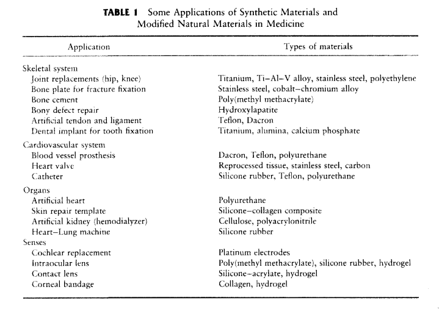

# Biomaterials

## Biomaterials

It is difficult to pinpoint the precise origins of the term "biomaterial".
However, it is probable that the field we recognize today was solidified
through the early Clemson University biomaterials symposia in the late 1960s
and early 1970s. The Society For Biomaterials was formed in 1975.

Although the biomaterials are primarily used for medical applications, they are
also used to grow cells in culture, in apparatus fro handling proteins in the
laboratory, in devices to regulate fertility in cattle, in the aquaculture of
oysters, and possibly in the near future they will be used in a cell-silicon
"biochip" that would be integrated into computers.

- Many definitions have been proposed for the term "biomaterial". One
  definition, endorsed by a consensus of experts in the filed is by Williams,
  1987, "a biomaterial is a nonviable material used in a medical device,
  intended to interact with biological systems".
- A complementary definition essential for understanding the term "biomaterial"
  is "biocompatibility". Again by, Williams 1987, "Biocompatibility" is the
  ability of a material to perform with an appropriate host response in a
  specific application
- Biocompatibility is what sets biomaterials apart from most materials explored
  in materials science.
- Are Biocompatible. i.e. When placed inside biological environment does not
  elicit any adverse affects in the host. A normal foreign body would cause
  inflammation, rejection or immune response when in contact with living
  tissues. A biocompatible material does not cause any of these.
- What makes a material biocompatible? Protein adsorption, which in turn
  depends on the surface properties of the material.

### Classes of materials used in medicine

1. Synthetic
    1. Metals
    1. Polymers
    1. Ceramics
    1. Composites
1. Natural -> Tissue engineering 
    1. Collagen 
    1. Natural scaffolds

Ti-Al-V (Titanium-Aluminum-Vanadium)

### Methods of Surface Characterization

## Tissue Device Interactions

Affects of biomaterials inside the host:

1. Biochemical response
    - Protein adsorption
    - Initiation of:
        1. Coagulation cascade
        1. Complement cascade
1. Cellular response
    - Platelet/Thrombocyte deposition
    - Leukocyte recruitment and adhesion
    - Cellular ingrowth, there will be endothelial and muscle cells ingrowth
    - Chemical messengers such as complement proteins are activated
1. Systemic response
    - Thrombosis
    - Anastomotic Intimal Hyperplasia
    - Infections

### Inflammation

<!-- See tdi.pdf -->

* Mediators -> either cell-derived or plasma-protein derived
    - Histamine, serotonin, cytokines, chemokines, protein fragments such as
      C3a, C5a, C3b produced due to complement system activation, and other
      products of coagulation cascade, fibrinolysis system and kinin systems.

1. Acute inflammation
    - lasts from a few minutes to a few days, 
    - marked my arrival of leukocytes @ site of injury

1. Chronic inflammation
    - persistent inflammatory stimulus leads to chronic inflammation that lasts
      from several months to years
    - characterized by presence of lymphocytes
    
