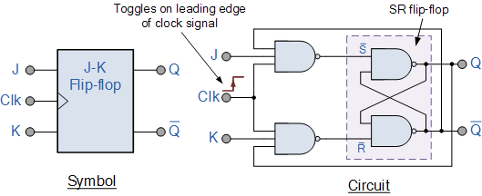

<h1 align="center">Digital Electronics, Microprocessors & Signal Processing</h1>

## Boolean algebra and Logic Gates

### Basic Gates

1. OR: The output of OR gate is "high" or "1" if at least one of its inputs is
   "high" or "1", otherwise, the output is "low" or "0".

2. AND: Output is "high" or "1" iff all of its inputs are "high" or "1",
   otherwise, the output is "low" or "0".

3. NOT: Output is the opposite of its input.
### Derived Gates

1. **NOR**: OR THEN NOT; which means the output of the NOR gate is "low" or "0"
   if any one of its inputs is "high" or "1", otherwise, the output is "high"
   or "1".

2. **NAND**: AND THEN NOT; the output of the NAND gate is "low" or "0" if all
   of its input is "high" or "1", otherwise the output is "high" or "1".

3. **XOR**: Exclusive OR; outputs a "high" or "1" only if an odd number of its
   input signals are "high" or "1", and a "low" or "0" if an even number of its
   input signals are "high" or "1".

4. **XNOR**: Exclusive NOR; outputs "high" or "1" only if all of its input
   signals are same, otherwise outputs "low" or "0".

---
### De-Morgan's Law

Set of two logical equivalences that relate to negation  of logical statements.

1. Then negation of a conjunction (AND) is logically equivalent to the
   disjunction (OR) or the negations of terms.

   $$\neg(p \land q) \equiv \neg p \lor \neg q$$

   This law states that if it not true that both p and q are true, then either
   p is false or q is false or both.

2. The negation of a disjunction (OR) is logically equivalent to the
   conjunction (AND) of the negations of the terms.

   $$\neg(p \lor q) \equiv \neg p \land \neg q$$

   This law states that if it not true that either p or q is true, then both p
   and q are false.

## Sequential Circuit Flip Flops

CLK -> A device may work either on the rising edge of the clock or on the
trailing edge of the clock.

1. D flip-flop (data flip-flop)
   * Output = Input

1. SR flip-flop (set-reset) 
    

    * Q is 0 when reset
    * Q is 1 when set
    * Q does not change when neither set nor reset [i.e. Q previous]
    * Setting and resetting simultaneously is not allowed

    
1. JK flip-flop
    

    * Q is 0 when reset
    * Q is 1 when set
    * Q does not change when neither set nor reset [i.e. Q previous]
    * Q toggles

1. T flip-flop (toggle flip-flop)
    

    * When T is 1 is one toggle

1. Master Slave flip-flop

## Programmable Logic

### Programmable Logic Array

- Contains a programmable AND array and a programmable OR array.
- Used to implement any combinational logic function by programming the inputs
  and outputs of these two arrays.
- PLA can also be programmed to implement sequential logic functions by using
  feedback loops to connect the outputs of the inputs.

### Programmable Array Logic

- Contains a programmable AND array and a fixed OR array.
- The OR array is pre-designed and cannot be reprogrammed whilst the inputs of
  the AND array can be programmed to implement any combinational logic function
- The outputs are connected to the fixed OR array to generate the final output.

## Asynchronous Interface

### ASCII Code

* American Standard Code for Information Interchange
* 1960 
* 7-bit i.e. 0 through 127 character representation of (i) alphanumeric, (ii)
  symbolic and (iii) control characters
* Modern computer system use a different 8-bit encoding, which is backward
  compatible with ASCII.
* A (65), a (97), 0 (48)
