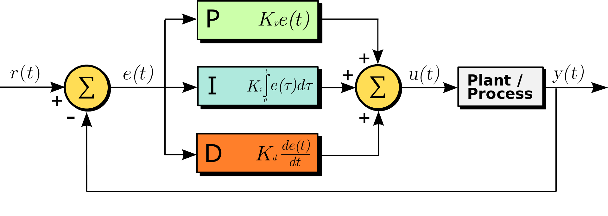
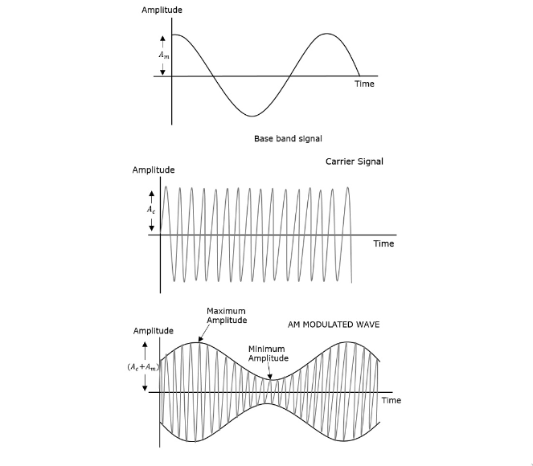

<h1 align="center">Control and Communication Systems</h1>

## System Modelling

System model $\rightarrow$ a set of mathematical equations that reflect
the design of a system [electrical or mechanical]. 

3 ways to model a system:

1. Differential equation model [Time(t) domain]
1. Transfer function model [Complex frequency ($s=\sigma+j\omega$) domain]
    1. Block diagram
    1. Signal flow graphs
1. State space model [Lower order time-domain equations in matrix notations]

Before you start with system design see [Components of a System](
./9 Control and Communication Systems.md) first.

We want to be able to (i) model a system and then (ii) control it. Hence the
"control systems". [PID Controller](./9 Control and Communication Systems.md)
is a device that employs a control loop mechanism with feedback for system
control.

---
## Components of a System

### Mechanical System

1. Translation mechanical system 
    * Input: Force
    * Output: Linear displacement
    * Components:
        1. Mass
        1. Spring
        1. Dashpot
1. Rotational mechanical system 
    * Input: Torque
    * Output: Angular displacement
    * Components:
        1. Moment of inertia
        1. Torsional spring
        1. Torsional dashpot

### Electrical System 

* Input: Voltage
* Output: Current (i.e. flow of charge)
* Components:
    1. Resistance
    1. Inductance
    1. Capacitance

---
## Analysis: Linearised Approximations

Responses:

1. Transient response
1. Steady response; studied using impulses:
    1. Unit
    1. Step
    1. Ramp 
    1. Parabolic

Stability: Bounded-Input, Bounded-Output (BIBO)

1. RA criterion
1. Nyquist criterion
1. Bode criterion $\rightarrow$ Amplitude and Phase
1. Eigen value criterion [only for state-space models]

### PID Controller

* Proportional-Integral-Derivate Controller [Present-Past-Future]
* Basic operation
    * Provides continuously modulated control by continuously calculating an EV
      (error value) [as the difference between a SP (set point) and the current
      output i.e. process variable (PV)] and applies an accurate and responsive
      correction to it based on the PID terms.
        1. P $\rightarrow$ (Proportional) component adjusts the input to the
        system in proportion to the EV. If the EV is too high and positive the
        input is proportionately increased and if the EV is high and negative
        the input is proportionately decreased, until a minimum, acceptable
        value for SP-PV offset is attained.
        1. I $\rightarrow$ (Integral) component adjusts the input based on the
        accumulated error over time. The cumulative EV is integrated over time,
        which means that if the output has been consistently too high or two
        low, the input will be adjusted accordingly, even if the current error
        is small.
        1. D $\rightarrow$ (Derivative) component adjusts the input based on
        the rate of change of the error. This helps anticipate the changes in
        the output and adjust the input before the input becomes too large.
    * Tuning: Each of P, I and D components are tuned (their gain constants are
      changed) to achieve an optimal control action which includes response
      time, stability, and steady-state errors. The tuning parameters must be
      derived for each control function, as they depend on the response of
      characteristics of the system themselves. Common methods for tuning a PID
      controller are:
        1. Experimental (Trial and Error)
        1. Ziegler Nichols Method
        1. Cohen-Coon methods
        1. Adaptive control

---
## Analog and Digital Communication Sources

* Analog sources generate continuous, time varying signals the can take on any
  value within a range of possible values. Examples include sound,
  physiological signals, TV cable, radio waves.

* Digital sources generate discrete, time independent signals that hop between
  0 and 1. Examples, text messages, ethernet, WiFi, LiFi, Bluetooth.

Transmitters $\rightarrow$ Transmission channels $\rightarrow$ Receivers

### Transmitters and Receivers

* Analog Transmitters: Modulators and wires; AM/FM radio stations,
  Walkie-Talkies, Wires: co-axial cables, Landline telephone cables, radio
  jacks (mono, stereo), VGA. 

* Digital Transmitters: WiFi routers and modems, switches and hubs, Bluetooth
  Devices, Cell phone towers, Wires: Twisted pair cables, Ethernet (RJ45), USB
  devices, HDMI.

> Satellites may use both digital and analog signals.

See [Transmitters](
https://www.tutorialspoint.com/analog_communication/analog_communication_transmitters.htm)
and [Receivers](
https://www.tutorialspoint.com/analog_communication/analog_communication_receivers.htm).

---
## Types and reasons for Modulation

Reasons:

1. To cope with physical limits such as bandwidth.
1. Security and reliability.
1. Speed/Rate and timing of transmissions.

Types:

1. Analog Modulation
    1. Amplitude modulation (AM)
    1. Angle modulation
        1. Frequency modulation (FM)
        1. Phase modulation (PM)
1. Digital Modulation
    1. Amplitude-shift Keying (ASK)
    1. Frequency-shift Keying (FSK)
    1. Phase-shift Keying (PSK)
        1. Differential PSK (DPSK)
        1. Differential Quadrature PSK (DQPSK)
    1. Quadrature Amplitude Modulation (QAM)
    1. Spread Spectrum Modulation

> With analog modulation, a certain degree of signal distortion will always
> occur due to [static] noise (thermal, electrical, impulse that can occur due
> to several factors such as lightning, internal electronic components) and
> interference (cross-talk). [We need to be able to scale and minimize this
> distortions.]

Some Defs:

* Modulating signal: The signal that carries information and used to modulate
  the carrier signal.
* Carrier signal: The signal that has no information and is to be modulated by
  the modulating signal.
* Modulation index $\rightarrow$ aka Modulation depth is the level of
  modulation that the carrier wave undergoes. Expressed in % and different for
  different types of modulation. Modulation index determines weather a signal
  is perfectly modulated or under modulated or over modulated.
* Bandwidth is the difference between the highest and the lowest frequency
  components of a signal.

### Amplitude Modulation

If modulating signal is $$m(t) = A_m \cos(2\pi f_mt)$$ 
and the carrier signal is
$$c(t) = A_c \cos(2\pi f_ct)$$ 
then the equation of amplitude modulated wave will be
$$s(t) = [A_c + A_m \cos(2\pi f_mt)] \cos(2\pi f_ct)$$.

Modulation index $$\mu = \frac{A_m}{A_c} \equiv \frac{A_{max}-A_{min}}{A_{max}+A{min}}$$.

See Bandwidth and Power of AM Wave.

Some Versions of AM:

1. DSBSC
1. SSBSC $\rightarrow$ Loss of information occurs.
1. VSBSC 
    Part of 

Transmission of such AM waves are inefficient so we perform DSBSC (Double Side
Band Suppressed Carrier), where we multiply the modulating and carrier signal
to get an AM wave. Such AM wave does not have a carrier.

$$s(t) = \frac{A_mA_c}{2} \cos[2\pi (f_c + f_m)t] + \frac{A_mA_c}{2} \cos[2\pi
(f_c - f_m)t]  $$

So $P_t$ becomes $2 * (A^2_m A^2_c)/8R$

---
## Nyquist Sampling Theorem

[Tentative] Statement: 

If an analog signal was converted into digital signal, and if you wish to
**accurately** retrieve the signal back in its analog form, the sampling
frequency (i.e. the number of sampling points) used to digitized the signal
must be greater than or equal to the twice of the of the highest frequency
component of original analog signal.

$$ N \ge 2 \times frequency_{max}  $$

> You can **NEVER** convert a digital signal back into a pure analog signal.
